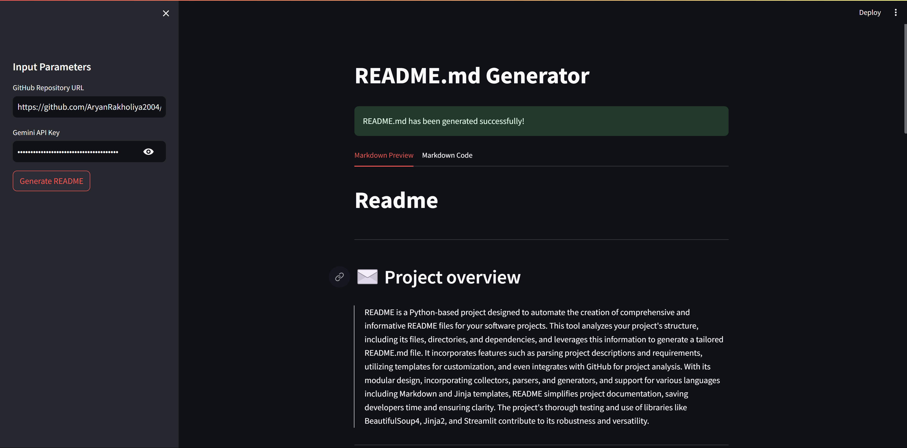

# README.md Generator

---
## ✉️ Project overview
> README is a comprehensive Python project designed to automate the creation of professional README files. This project analyzes a given project's structure, including files, directories, and dependencies specified in requirements.txt, and leverages this information along with a combination of local and GitHub parsing capabilities to generate a detailed and informative README. The project utilizes Jinja2 templating for customizable content formatting and includes modules for data collection, parsing, and content generation. Furthermore, it incorporates testing frameworks, ensuring the reliability and accuracy of the generated README files. Whether you're documenting a new project or updating an existing one, README offers a streamlined solution for creating high-quality documentation.


---

## 

---

## 🍵 Features

- Automates the creation of **README.md** file.
- Generate **directory tree** from project file structure.
- Parse GitHub repositories.

---

## 🗂️ Project Structure
```
README/
├── 📄 app.py
├── 📄 Generated_README.md
├── 📄 LICENSE
├── 📄 README.md
├── 📄 requirements.txt
├── 📄 template.py
└── 📁 readme_gen
    ├── 📄 exception.py
    ├── 📄 logger.py
    ├── 📄 utils.py
    ├── 📄 __init__.py
    ├── 📁 collector
    │   ├── 📄 data_reader.py
    │   └── 📄 __init__.py
    ├── 📁 generator
    │   ├── 📄 content_formatter.py
    │   ├── 📄 content_writer.py
    │   └── 📄 __init__.py
    ├── 📁 parser
    │   ├── 📄 github_parser.py
    │   ├── 📄 local_parser.py
    │   └── 📄 __init__.py
    ├── 📁 templates
    │   ├── 📄 default.md.jinja
    │   ├── 📄 macros.jinja
    │   └── 📄 __init__.py
    ├── 📁 temp_project_directory
    │   └── 📁 cloned_projects
    │       ├── 📄 project_description.txt
    │       └── 📄 project_requirements.txt
    └── 📁 tests
        ├── 📄 test_github_parser.py
        ├── 📄 test_local_parser.py
        └── 📄 __init__.py

```
---

## 🛠️ Technologies Used
This project uses:
- jinja2
- python

---


## 📥 Installation

Install dependencies:

```bash
pip install -r requirements.txt
```


---
## 📄 License
This project includes a license file.


---